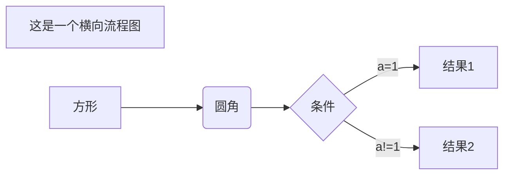
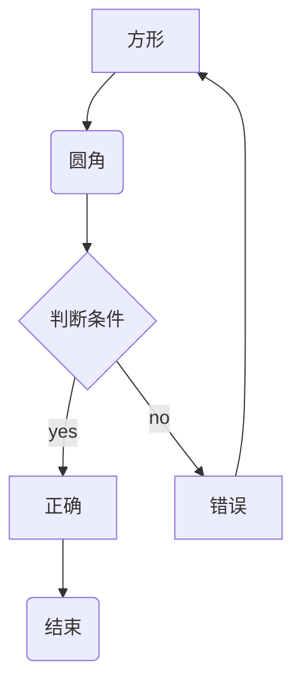

<h1 align=center>
  markdown流程图
</h1>

## flow 流程图

```
# flow 声明是flow形式 就是从上到下的
#```flow

# st 这里和 变量名称类似 后面接声明的框框类型
# 有点像 声明式 UI 
# 可以先写个开头和结尾  然后把流程写出来 不然不会显示出来

   
# -> 表示走向 流程

   
# () 里面可以写一些 配置选项 
# 这里 判断就可以写 yes/no
   cond(yes)->io->e   
# 这里right 表示 线条从右边绕
   cond(no)->sub1(right)->op
```


```flow
   st=>start: 开始框
   
   op=>operation: 处理框
   
   cond=>condition: 判断框(是或否?)
   
   sub1=>subroutine: 子流程
   
   io=>inputoutput: 输入输出框
   
   cond2=>condition: 判断()
   
   e=>end: 结束框
   

   st->op->cond

   cond(yes)->io->e
   
   cond(no)->sub1(right)->op
```


## mermaid 横向流程图



## mermaid 竖向流程图



## UML 时序图

```sequence
# -> 直线
# ->> 实线箭头
# --> 虚线

title : UML 时序图 

# 声明 参与者的从做到右显示顺序
participant ios 
participant server
participant APNS

note over server,APNS: server of ios 


ios -> server: send device token
note left of ios :  iOS is client
note right of server: server is service 

server -> ios : response recive device token

ios --> server : send heart beat
server --> ios : response heart beat

server -> APNS : push notification on already device token phone 

note right of APNS : APNS is apple notification service server

APNS -> APNS : find all device from receive bundle id and keychain

APNS --> ios : push remote notification

participant aloneServer 

note right of aloneServer : nothing server


```

## 甘特图

```mermaid
  gantt
  dateFormat YYYY-MM-DD
  title 软件开发甘特图
  
  # name : status,timeVar,timeInit,endtime(d h )
  
  section 设计
  需求                      :active,    des1, 2019-8-1,3d
  原型                      :active,  des2, 2019-8-10,5d
  UI设计                     :         des3, after des2, 5d
  未来任务                     :         des4, after des3, 5d

section 开发

前端三方库集成				: crit ,d1,2019-8-15,1d
前端开发、后端				:  d2 ,after d1,10d
测试 						: a1, after d2,3d
上线						: s1, after a1,49h
推广						: t1, after s1, 3d

```

